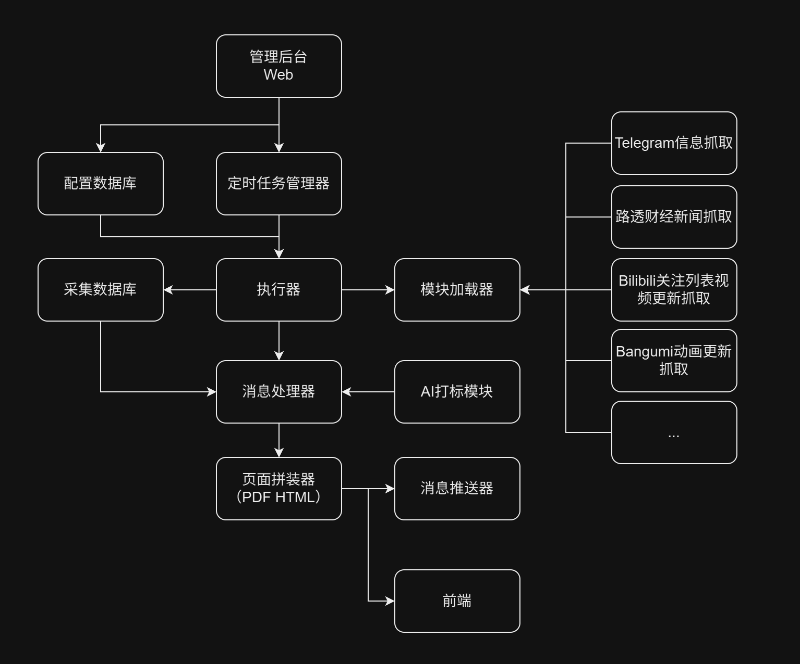
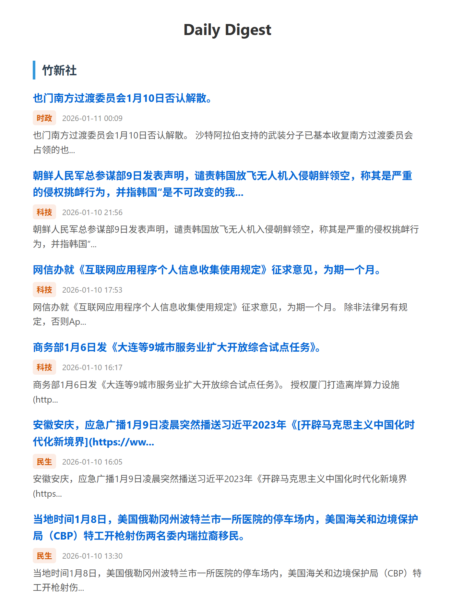
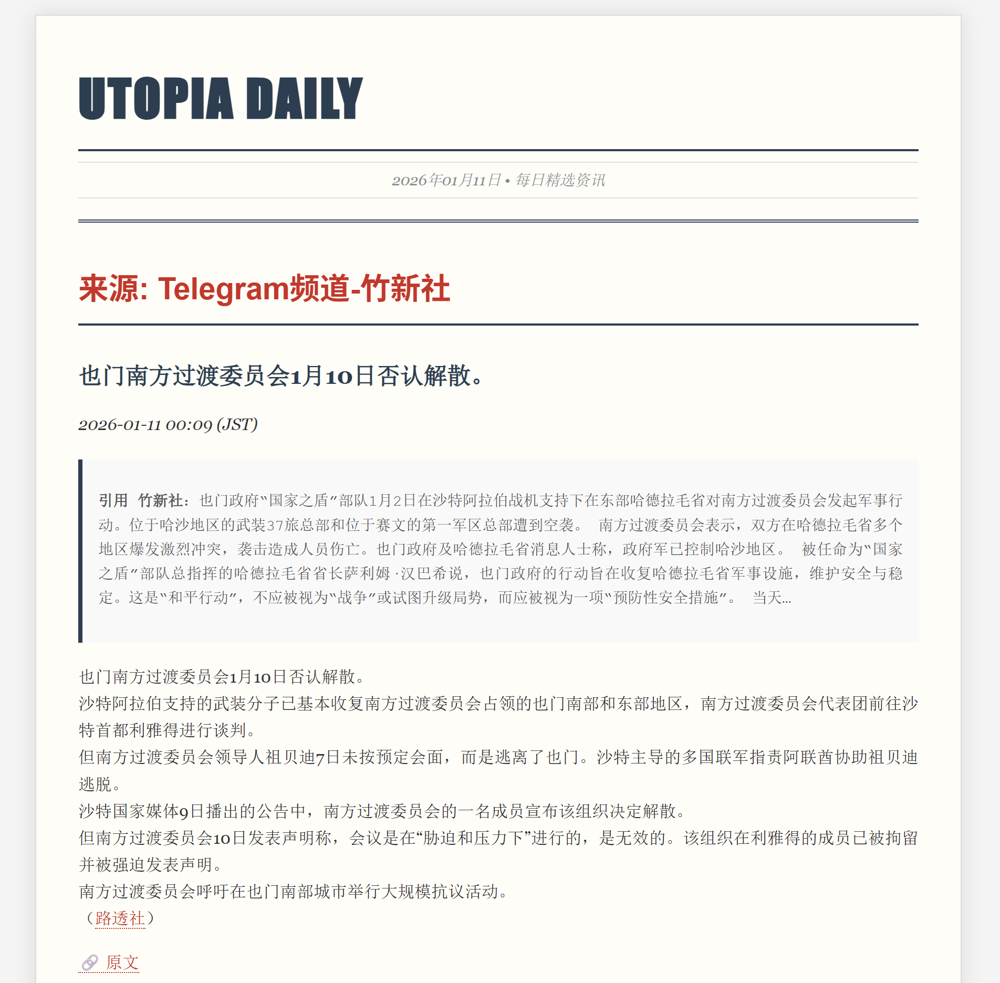

# Utopia Daily

WIP  

这是一个开发中的项目。旨在进行新闻抓取。支持模块化加载和可视化配置网页。支持AI打标分析。    
灵感来源：[TrendRadar](https://github.com/sansan0/TrendRadar)  
<br>
本项目目标是构建一个大型的可拓展的模块化系统，而非易于部署。前期将仅提供docker与直接运行的部署方式。  
<br>
由于我的目标是在我一个i5-8350U的上古Ubuntu Server系统的老旧笔记本上运行本程序，因此设定以下技术目标：  
最低运行环境：1H CPU（400GFLOPS/H），1G内存，1G磁盘空间（包含docker镜像大小）  
推荐运行环境：4H CPU，2G内存，10G磁盘空间。  
<br>
警告：本项目大量使用Gemini等生成式AI。开发工具：PyCharm + Gemini Code Assist插件 + Copilot插件  
<br>
警告：目前代码均为测试用途，还没有进行业务逻辑的实现，请不要fork，pr等。

## 初期开发计划
- [x] 架构设计
- [x] Android-Like Logger
- [x] i18n框架
- [x] 抓取模块加载器
- [ ] 信息推送模块加载器
- [ ] 定时任务
- [x] 控制面板架构与相关数据库设计
  - [x] 登录
  - [x] 总览
  - [x] 系统配置
  - [x] 用户配置
  - [ ] 抓取模块配置
  - [ ] 信息推送模块配置
  - [ ] 定时任务配置
  - [ ] 表示用前端配置
  - [ ] 个人推送配置
  - [ ] AI 配置
- [ ] HTML 拼装
- [ ] AI 分类打标
- [ ] 表示用前端
- [ ] 审阅 AI 代码

## 开发阶段调试方法
### 直接调试
```bash
cd ${base_path}/Utopia-Daily
pip install -r requirements.txt
cd src/web/dashboard/frontend
npm run build
cd ${base_path}/Utopia-Daily/src
python app.py
# localhost:8000
# 修改数据库迁移或数据库设计后需删除数据库文件再启动（开发阶段）
```

### Docker 调试
```bash
cd ${base_path}/Utopia-Daily
docker build -f docker/Dockerfile -t utopia-daily .
docker run -d -p 8000:8000 utopia-daily
# localhost:8000
```

## 架构


## Demo图
### Email Digest


### Full Page
